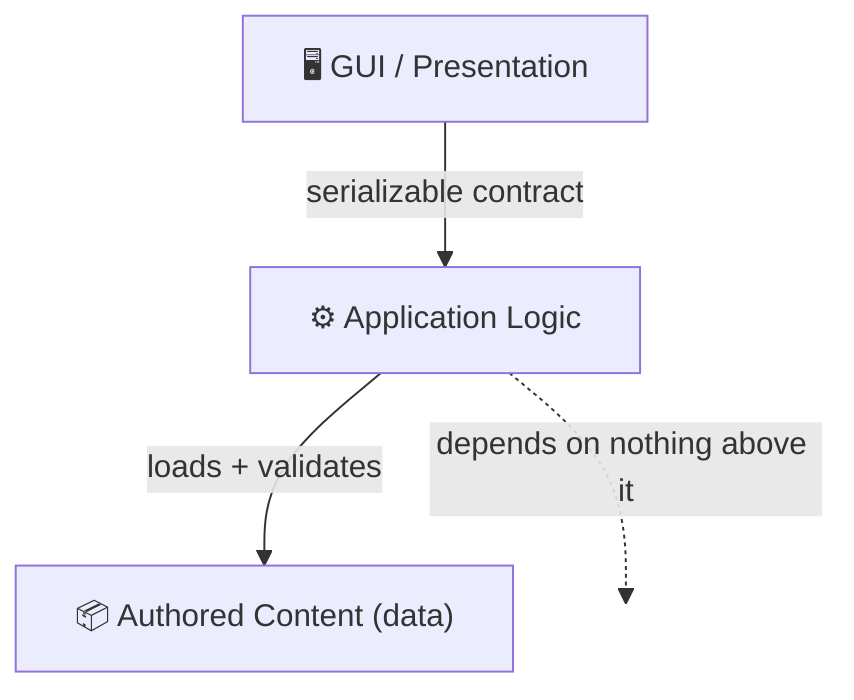

<!--
Sync Impact Report
==================
Version change: 1.7.0 → 1.7.1 (PATCH — presentation/wording refinement)
Rationale: Condensed prose, added per-principle icons, a principles summary
  table, an architecture-boundary diagram, and a quality-gates table. No
  principle was added, removed, renamed, or redefined; every normative
  MUST/SHOULD rule and rationale is preserved. This is a non-semantic
  refinement → PATCH.
Modified principles: none (wording condensed only)
Added sections: Principles-at-a-glance table; Architecture Boundaries diagram;
  Quality Gates table
Removed sections: none
Templates requiring updates:
  ✅ .specify/templates/plan-template.md — version reference v1.7.0 → v1.7.1;
    Constitution Check gates unchanged (principles unchanged)
  ✅ .specify/templates/tasks-template.md — no change needed
  ✅ .specify/templates/spec-template.md — no change needed
  ⚠ README.md / docs/quickstart.md — do not exist yet; document local test
    commands when created
Follow-up TODOs: none
-->

# 📜 TradeWright Constitution

`v1.7.1` · 🗓️ Ratified 2026-06-11 · ✏️ Last Amended 2026-06-13

## Core Principles

> 🚦 **Legend** — 🔴 blocks merge · ✅ compliance test · 🚫 prohibited

| # | 🔣 | Principle | In one line |
|---|----|-----------|-------------|
| I | 🧪 | Test-First Quality **(NON-NEGOTIABLE)** | No feature is done without passing unit + E2E tests. |
| II | 🔁 | CI/Local Test Parity | Same suite, same commands, locally and in CI. |
| III | 🧩 | Separation of Concerns | One module, one responsibility; deps point one way. |
| IV | 📦 | Authoring–Implementation Separation | Content is declarative data, never hard-coded. |
| V | 🔌 | GUI–Logic Boundary | Talk only through a serializable, server-ready contract. |
| VI | 💬 | Comment Discipline | Default no comment; only non-inferable "why". |
| VII | 🎨 | UI Design Fidelity | Build the design artifact exactly; no silent drift. |
| VIII | 🪟 | Explorable UX | Neat up front, depth behind exploration. |
| IX | ⚡ | Latency-Tolerant Client | Never freeze the UI on a round-trip. |
| X | 🧹 | No Stale Content | Every written word describes the project as it is. |
| XI | 🎲 | Deterministic Tests | Same code → same result, every run, every machine. |

### 🧪 I. Test-First Quality (NON-NEGOTIABLE)

Every feature MUST ship with two mandatory test layers:

- 🔬 **Unit** — all logic modules (rules, state, data transforms); public
  surface + error paths + boundary conditions.
- 🖱️ **E2E** — every user-facing flow, exercised as a user via Playwright.

✅ "Done" = both layers exist **and** pass. Test tasks are never optional. A
spec without testable acceptance scenarios is incomplete. 🐛 Bug fixes MUST add
a regression test that fails before the fix and passes after.

> **Why** — tests enforce every other principle; violations surface as failures,
> not production surprises.

### 🔁 II. CI/Local Test Parity

- The full suite (unit + Playwright) MUST run in GitHub Actions on every PR and
  every push to main. 🔴 A red pipeline blocks merge — no skipped suites.
- The same suites MUST run locally via single documented commands (e.g.
  `npm test`, `npm run test:e2e`). CI invokes the **same** commands — no CI-only
  test logic.
- Local pass ⇒ CI pass; environment-specific divergence is a bug to fix.

> **Why** — CI-only tests get push-and-pray debugging; local-only tests rot.

### 🧩 III. Separation of Concerns

- One module = one stated responsibility. 🚫 Mixed concerns (render + rules,
  persist + present, content + behavior) MUST be split before merge.
- ➡️ Dependencies point one way (see diagram). Cross-cutting concerns (logging,
  config, persistence) live behind their own interfaces, not threaded through
  feature code.

> **Why** — clean seams make code testable (I) and re-architectable (V).
> IV and V are the two project-specific applications of this rule.

### 📦 IV. Authoring–Implementation Separation

- Authored content (definitions, data, copy, scenarios) MUST be declarative data
  in its own directory tree — never hard-coded into source.
- Code loads, validates, and interprets content through a schema; it never
  embeds it. Schemas MUST be validated at load/build time so malformed content
  ⚡ fails fast.
- ✅ **Test** — an author changes content without touching code; an engineer
  refactors code without rewriting content.

> **Why** — authoring and engineering iterate at different speeds; entangling
> them turns every tweak into a code review and every refactor into a migration.

### 🔌 V. GUI–Logic Boundary (Server-Ready Logic)

The logic layer WILL move to a server, so the boundary is explicit now:

- 🔗 GUI ↔ logic communicate only through a defined contract (typed
  commands/queries/events). 🚫 GUI MUST NOT reach logic internals; logic MUST NOT
  import GUI/framework/render code.
- 📦 Logic is self-contained: no DOM, no UI deps, no same-process assumption.
  All boundary data MUST be serializable.
- ✅ **Test** — swap in-process logic for a remote server behind the same
  contract → no GUI change beyond the transport adapter.
- Unit tests hit logic through the contract; Playwright hits the GUI side. A
  contract change updates both.

> **Why** — a thin interface now vs. a rewrite later; the serializable contract
> also gives tests a stable seam.

### 💬 VI. Comment Discipline

Default: **NO comment.** Write one ONLY for non-inferable knowledge:

- 📌 a constraint/invariant/contract the reader cannot infer (e.g. "schema
  validation MUST precede migration").
- ❓ a non-obvious "why" — external-bug workaround, deliberate deviation, perf
  trade-off.

🚫 Prohibited (remove in review): restating code, narrating history, describing
the next line, addressing reviewers. Prefer renaming/restructuring over a "what"
comment. Any surviving comment MUST be kept accurate.

> **Why** — comments are untested and rot silently; reserving them keeps the
> survivors trustworthy and code the single source of truth.

### 🎨 VII. UI Design Fidelity

- Implementation MUST match the design artifact: layout, spacing, typography,
  color, labels, component states, interactions. 🚫 No improvised visual or
  interaction changes.
- The design artifact is the source of truth and lives with content (IV).
- ⚠️ Impractical/ambiguous/incomplete design → update the artifact (or record a
  signed-off deviation) **before** the divergent code merges. Silent drift is a
  violation.
- Playwright SHOULD assert design-driven properties (structure, labels, visible
  states) so fidelity regressions fail CI.

> **Why** — silent divergence makes artifacts untrustworthy and turns every
> review into opinion; this extends IV to the visual layer.

### 🪟 VIII. Explorable UX — Progressive Disclosure

Apple-spirit: **clarity, deference, depth** — neat up front, depth discoverable.

- 🧼 **Clean primary surfaces** — each screen shows only its primary task. Rework
  before implementing anything that stacks advanced/dense/secondary content up
  front.
- 🔍 **Depth via exploration** — detail and advanced controls live one level
  deeper, reached through obvious affordances. Hidden ≠ undiscoverable.
- 🎯 **Never bury the primary action** — disclosure applies to secondary content
  only.
- Every UI artifact (VII) MUST state its primary task and what is deferred
  deeper. Contested → default to the calmer surface.

> **Why** — surfaces optimized for legibility serve daily use; depth behind
> exploration serves experts; the stated split makes "neat up front" reviewable.

### ⚡ IX. Latency-Tolerant Client

Design around UX, not implementation convenience. 🚫 Anti-pattern: every
interaction silently waiting on a server round-trip.

- ⚡ **Immediate feedback, always** — UI acknowledges every interaction locally;
  never frozen pending the network.
- 🔮 **Optimistic by default** — predictable outcomes applied now, reconciled on
  confirm. Rejection rolls back visibly and explains — never silently.
- ⏳ **Honest pending states** — genuine server dependence shows a scoped
  in-progress state; unrelated interactions stay responsive.
- 🔌 The contract (V) MUST be asynchronous and support optimistic
  apply + reconcile. A request-blocked contract is a design defect.
- Designs classify each interaction: `local-immediate` ·
  `optimistic-with-reconciliation` · `server-confirmed-with-pending`.
  🚫 "Blocks the UI" is not a category.

> **Why** — logic moves to a server (V); if responsiveness isn't designed into
> the contract now, every interaction inherits a round-trip later.

### 🧹 X. No Stale Content

Every persistent artifact (docs, agent context files like CLAUDE.md, specs,
plans, design artifacts, comments, config notes) MUST describe the project as it
**currently is**. Stale content = wrong information under the repo's authority.

- A change that invalidates written content updates/deletes it in the **same**
  change.
- Stale content found mid-task → fix on the spot if small; else a tracking issue
  in the same session. 🚫 Never left silently.
- 🔮 No future intent as current fact; aspirational material is labeled planned
  or omitted.
- 🗑️ Unverifiable cheaply → prefer deletion (missing prompts a question; wrong
  misleads).

> **Why** — humans and agents act on what's written; untrustworthy words force
> re-verifying everything. VI covers code comments; X covers every artifact.

### 🎲 XI. Deterministic Tests

Every test MUST be deterministic: same code → same result, on every run, in any
order, on any machine. An outcome that changes on timing/order/env/chance is a
defect.

- ⏰ **No uncontrolled nondeterminism** — clock, dates, time zones, locale,
  randomness MUST be fixed or injected.
- 🔀 **Order/isolation-independent** — own setup/teardown; passes alone, in any
  order, and in parallel.
- ⏱️ **No arbitrary waits** — wait on observable conditions, never guessed
  sleeps.
- 🌐 **No uncontrolled externals** — network, filesystem, third parties stubbed
  or pinned.
- 🔴 **Flaky = failing** — fix or quarantine with a tracking issue within one
  session; never silently retried into green.

> **Why** — a nondeterministic gate can't enforce anything. Determinism makes
> Test-First Quality (I) and CI/Local Parity (II) trustworthy instead of
> theatrical.

## Quality Gates & Testing Standards

Every PR MUST clear all gates (🔴 = blocks merge):

| Gate | 🔣 | Requirement |
|------|----|-------------|
| 1 — Unit tests | 🔬 | New/changed logic has unit tests; full unit suite passes in CI. |
| 2 — E2E tests | 🖱️ | New/changed user-facing flows have Playwright coverage; full E2E suite passes in CI. |
| 3 — Boundary | 🔌 | No GUI→logic-internals access, no logic→GUI imports, no content embedded in code. Enforce via lint/dependency-cruiser where possible, else review. |
| 4 — Local repro | 🔁 | Any new test type/tooling in CI is runnable locally via a documented command before the CI step merges. |
| 5 — Comments | 💬 | No comments that restate code, narrate changes, or address reviewers; survivors state non-inferable constraints/rationale only. |
| 6 — Design fidelity | 🎨 | UI changes match the referenced design artifact; deviations reflected in an updated artifact or recorded sign-off before merge. |
| 7 — Staleness | 🧹 | PR updates/removes every written artifact its changes invalidate; no future intent presented as current fact. |
| 8 — Determinism | 🎲 | New/changed tests obey Principle XI; any flaky test fixed or quarantined with a tracking issue in the same session. |

🎭 Playwright tests in particular use web-first assertions and fixtures rather
than sleeps (Principle XI).

## Development Workflow

- 🔄 All work flows through Spec Kit: **specify → plan → tasks → implement**.
  Plans MUST pass the Constitution Check before implementation; violations need
  an explicit Complexity Tracking justification.
- ✅ Feature task lists MUST include test tasks (unit, and Playwright for
  user-facing stories) — mandatory, not optional.
- 🗂️ Layout reflects the boundaries: `src/logic/`, `src/gui/`, `content/`, with
  tests mirroring the split (`tests/unit/`, `tests/e2e/`).
- ⚙️ The GitHub Actions workflow is code: reviewed like any other change and kept
  in sync with the locally documented commands.
- 📤 **Always commit and push** — every completed unit of work (a task, a
  spec/plan artifact, a constitution amendment) is committed with a descriptive
  message and pushed immediately, scoped to one logical change. Work MUST NOT
  accumulate uncommitted across sessions.

## Governance

This constitution supersedes all other development practices. Where a plan, task
list, or review conflicts with it, the constitution wins.

- 📝 **Amendments** — via PR that updates this file, states the rationale, and
  includes a Sync Impact Report. Dependent templates (`.specify/templates/*.md`)
  MUST update in the same change.
- 🔢 **Versioning** — semantic. **MAJOR** = remove/redefine a principle
  backward-incompatibly · **MINOR** = add a principle or materially expand
  guidance · **PATCH** = clarifications, wording, presentation.
- 🛡️ **Compliance review** — every plan's Constitution Check gates on the
  principles above; every PR review verifies the Quality Gates. Deviations are
  justified in Complexity Tracking or rejected.

**Version**: 1.7.1 | **Ratified**: 2026-06-11 | **Last Amended**: 2026-06-13
